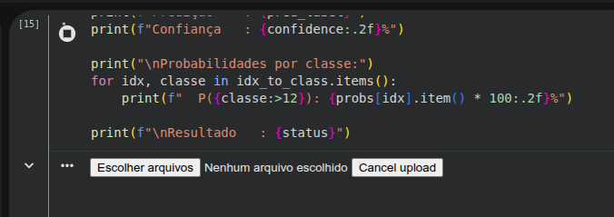

# Tech Challenge - Fase 1 | Projeto EXTRA

## Como Rodar o Projeto

Este projeto foi desenvolvido para ser executado no **Google Colab**.

Para rodar, baixe no GitHub o arquivo:

```text
tech_challenge_pcos_EXTRA.ipynb
```

Depois, importe esse arquivo no Google Colab e execute as celulas em ordem.

## Imagem para Predicao

Na etapa de predição é utilizada uma imagem que está na pasta `assets` do projeto.


Localização:

```text
assets/ovario_br_analises.jpg
```

Durante a execução desta etapa, na célula 15, é necessario enviar manualmente essa imagem no Colab.




## Passo a Passo no Google Colab

### 1. Baixar o projeto do GitHub

Clone o repositorio na sua maquina:

```bash
git clone <URL_DO_REPOSITORIO>
cd <NOME_DO_REPOSITORIO>
```

Depois de clonar, localize na raiz do projeto o arquivo:

```text
tech_challenge_pcos_EXTRA.ipynb
```

### 2. Abrir o Google Colab

Acesse:

```text
https://colab.research.google.com/
```

### 3. Importar o arquivo no Colab

No Google Colab:

1. Clique em **File > Upload notebook**.
2. Selecione o arquivo `tech_challenge_pcos_EXTRA.ipynb` baixado do GitHub.
3. Aguarde o notebook abrir no Colab.

### 4. Ativar GPU

No menu do Colab:

```text
Runtime > Change runtime type
```

Em **Hardware accelerator**, selecione uma GPU disponivel, como `T4 GPU`.

### 5. Executar o projeto

Execute as células do notebook em ordem, do inicio ao fim.

O notebook baixa o dataset automaticamente usando `kagglehub`.
